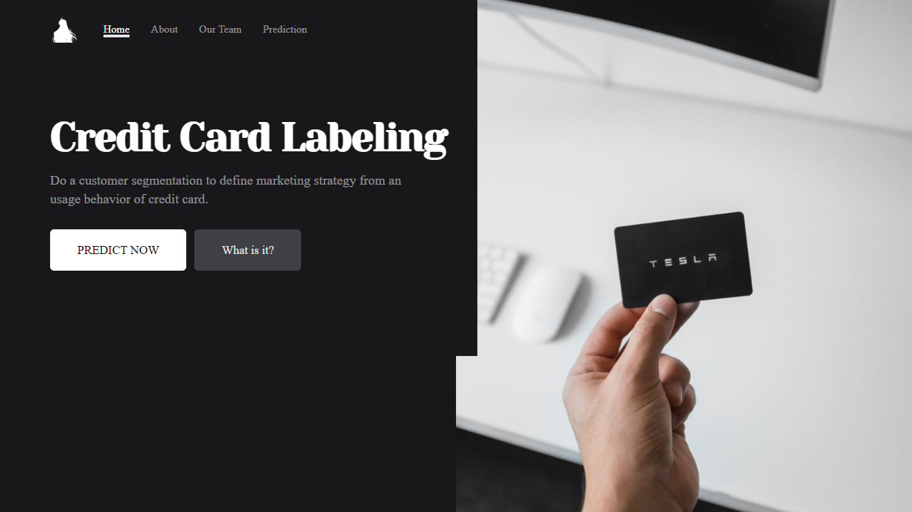

# Credit Card Clustering

## About

The purpose of this web is to cluster a credit card's user.

## Proccess

I use a web template from [project that was cleared](https://github.com/ZhafranBahij/heart-failure-predict-webvers). Honestly, it's not many difficult to create this web again because I have a foundation from previous project. This web using a vite with template ReactJS and flask.

## Source

- [Website](https://credit-card-gr4.herokuapp.com/)
- [Data for Training](https://www.kaggle.com/datasets/arjunbhasin2013/ccdata)
- [Tutorial React with Flask](https://towardsdatascience.com/build-deploy-a-react-flask-app-47a89a5d17d9)
- [Link to repo for Clustering a model](https://github.com/ZhafranBahij/credit-card-cluster)
